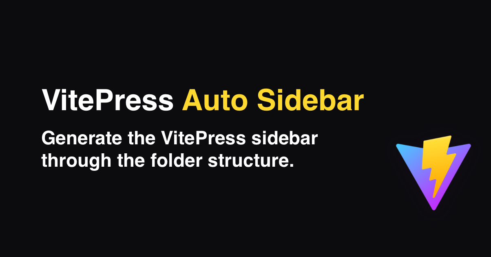

# :zap: VitePress Plugin: Auto Sidebar

[![npm version][npm-version-src]][npm-version-href]
[![npm downloads][npm-downloads-src]][npm-downloads-href]
[![License][license-src]][license-href]

> Generate the VitePress sidebar through the folder structure.

- [✨ &nbsp;Release Notes](https://github.com/JonathanSchndr/vitepress-plugin-auto-sidebar/releases)

## Features

- Small library
- TypeScript Support

## Setup

```sh
yarn add vitepress-plugin-auto-sidebar # yarn
npm i vitepress-plugin-auto-sidebar # npm
```

## Basic usage

.vitepress/config.js
```javascript
import { getSidebar } from 'vitepress-plugin-auto-sidebar'

export default {
  themeConfig: {
    sidebar: getSidebar({ contentRoot: '/', contentDirs: ['team'], collapsible: true, collapsed: true })
  }
}
```

## Options

* contentRoot – Default: '/'
  > String Root of your VitePress Docs
* contentDirs – Default: ['/']
  > Array of indexable contentRoot dirs, if you want to include seperatly
* collapsible – Default: true
  > Boolean whether the first level can be unfolded
* collapsed – Default: true
  > Boolean whether the first level items are already expanded after loading

**Tips：** If you want to ignore a file, name the `.md` file with an underscore ( `_` ).


## License

Copyright (c) 2022 Jonathan Schneider
[MIT License](./LICENSE)

<!-- Badges -->

[npm-version-src]: https://img.shields.io/npm/v/vitepress-plugin-auto-sidebar/latest.svg
[npm-version-href]: https://npmjs.com/package/vitepress-plugin-auto-sidebar
[npm-downloads-src]: https://img.shields.io/npm/dt/vitepress-plugin-auto-sidebar.svg
[npm-downloads-href]: https://npmjs.com/package/vitepress-plugin-auto-sidebar
[license-src]: https://img.shields.io/npm/l/vitepress-plugin-auto-sidebar.svg
[license-href]: https://npmjs.com/package/vitepress-plugin-auto-sidebar
